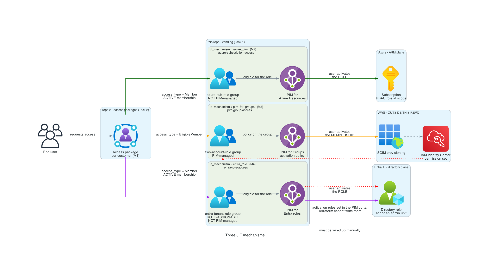

# terraform-azuread-access-vending

Terraform module that vends access through Entra groups: creates the groups,
binds them to Azure RBAC, AWS/GCP roles, or Entra directory roles, and sets
the PIM activation rules.

The module grants **no humans access**. It defines which access grants
exist; the access-package repo defines who can receive them.

```
access-vending  (this repo)             access-packages  (sister repo)
─────────────────────────────           ──────────────────────────────
WHICH access grants exist               WHO can receive them
group + role binding + PIM policy       access package per customer
                        │                        │
                        └──── group name ────────┘
                              (the contract)
```

## Structure

```
modules/access-vending/          ← THE CONSUMABLE MODULE. Start here.
  README.md                        Field reference, mechanisms, risks, decisions
  modules/                         Six submodules, one per responsibility

examples/complete/               ← THE TEMPLATE FOR A NEW ENVIRONMENT
  terraform.tfvars.example         All three mechanisms, ready to copy
examples/github-consumption/     ← Call the module from your own repo, with CI

bootstrap/                       ← One-time setup: managed identity + OIDC
  grant-graph-permissions.sh       Graph permissions. Read the list before running.

main.tf variables.tf outputs.tf  ← Thin wrapper. Used only by this repo's CI.
providers.tf versions.tf            External consumers use the module directly.
backend.hcl.example

archive/                         Outdated documents and reviews
generated-diagrams/              Architecture diagrams (English, see below)
```

**The root is not the module.** It exists because `azurerm` requires a `provider`
block due to `features {}`, and a reusable module should not have provider blocks —
otherwise the caller cannot use `count`, `for_each`, or `depends_on`. The root owns
the providers and backend; the module owns the logic.

## Getting started

Requires [Terraform](https://developer.hashicorp.com/terraform/install) **>= 1.9** and
[Azure CLI](https://learn.microsoft.com/cli/azure/install-azure-cli).

The version requirement is hard: the validations use cross-variable references, a
1.9 feature. On 1.5–1.8 the configuration fails with "Invalid reference in variable
validation" before anything else happens.

### 1. Bootstrap — the deploy identity

```bash
cd bootstrap
cp terraform.tfvars.example terraform.tfvars
# rediger: github_org, github_repo, state_storage_account_id
az login
terraform init && terraform apply -var-file=terraform.tfvars
```

### 2. Graph permissions

```bash
./grant-graph-permissions.sh
```

Missing permissions are the most common blocker. **Read the list in the script
before running it** — `RoleManagement.ReadWrite.Directory` lets the identity assign
directory roles across the entire tenant, including to itself. Only add it if you
actually use `jit_mechanism = "entra_role"`.

If you use `azure_pim`, the identity also needs `User Access Administrator`
or `Owner` on each subscription. `Role Based Access Control Administrator`
is sufficient for the role bindings, but **not** for the PIM policies. See
`next_steps` in the bootstrap output.

### 3. Set up the environment

```bash
cp -r examples/complete/ ~/mitt-miljo/
cd ~/mitt-miljo/
cp terraform.tfvars.example terraform.tfvars
# bytt ut alt som står REPLACE
terraform init && terraform plan
```

The field reference is in
[`modules/access-vending/README.md`](modules/access-vending/README.md).

### 4. Then the access-package repo

Vending must apply **first**. This is stricter than "the groups must exist": for
`pim_for_groups` the PIM policy must be written, otherwise the access
package picker only offers `Member` and not `Eligible Member`. That gives you active
membership instead of JIT, without anything failing.

The ordering is not enforced by Terraform.

## Verify

```bash
terraform output access_summary                   # group name, mechanism, model, role
terraform output approvers_by_role                # who approves what
terraform output approver_group_names             # contract towards repo 2
terraform output group_names                      # contract towards repo 2
terraform output target_cloud_bindings            # what SCIM must connect (M3)
terraform output entra_activation_governance_gap  # what Terraform does not control (M4)
terraform output demo_eligibility_schedules       # should be empty
```

`terraform plan` after the first `apply` should say "No changes".

### Before you test activation

The approver groups are seeded with the `systemeier`, so a `dual` role is
activatable from the first apply. PIM has no default approvers for `azure_pim` or
`pim_for_groups`, and a request with no reachable approver times out after 24
hours — seeding prevents that.

Add at least one more member before testing in earnest: an approver cannot
approve their own request, so a single systemeier cannot activate their own
`dual` role. Additional approvers should come from an access package.

## The three mechanisms, briefly

| `jit_mechanism` | For | JIT resides in | Terraform sets the activation rules |
| --- | --- | --- | --- |
| `azure_pim` (default) | Azure RBAC | the role | yes |
| `pim_for_groups` | AWS, GCP, GitHub | the membership | yes |
| `entra_role` | Entra directory roles | the role | **no** |

Two gaps are intentional and documented, not forgotten:

- **`pim_for_groups` does not connect the group to the target cloud.** That is done
  with SCIM on the cloud side. `target_cloud_bindings` is the work list.
- **`entra_role` cannot get activation rules from Terraform.** There is no
  policy resource for directory roles in `azuread`. The rules are set in the PIM
  portal, and the gap is visible in `entra_activation_governance_gap`.

Full description in
[`modules/access-vending/README.md`](modules/access-vending/README.md), along with
the risks (R1–R5) and decisions (B1–B5).

## Diagrams



The diagrams are in English even though the documentation was originally in
Norwegian — graphviz ASCII-fied the Norwegian characters, and English gives
readable labels without having to work around the problem.

- `generated-diagrams/jit-mechanisms.png` — the three mechanisms side by side
- `generated-diagrams/target-architecture.png` — the target design in full
- `generated-diagrams/module-resource-graph.png` — which resources each mechanism
  creates, and which provider they belong to

## Security assumptions

Three things that are not obvious, and that determine whether the solution holds:

**Run apply as a service principal, not as a user.** Graph makes the identity
running Terraform the owner of all groups, and the ownership cannot be removed. A
service principal with `Group.ReadWrite.All` can change membership regardless, so
ownership gives it no new power — but a user account becomes one human with
standing ability to bypass the access package, unseen in any plan.

**`entra_role` grants power over the other mechanisms.** `Groups Administrator`
can manage membership in all non-role-assignable groups — that is, in all
`azure_pim` and `pim_for_groups` groups — and can rewrite their PIM policies.
Choose the role with that in mind.

**The activation rules are more weakly enforced than they appear.** All attributes
in the policy blocks are `Optional+Computed`: where the module does not set a
value, the tenant default wins without the plan reporting it. The output
`activation_settings` echoes the input, not the actual policy. See R2 in the
module's README.

## Development

```bash
terraform fmt -check -recursive
terraform validate

cd modules/access-vending && terraform init -backend=false && terraform validate
```

Provider isolation is verifiable, not just claimed:

```bash
cd modules/access-vending/modules/pim-group-access
terraform init -backend=false && terraform providers
# azuread + time, ingen azurerm
```

`archive/` contains earlier architecture documents and two peer reviews.
They are not maintained and should not be read as current — several of the claims
there have been corrected in the code since.
